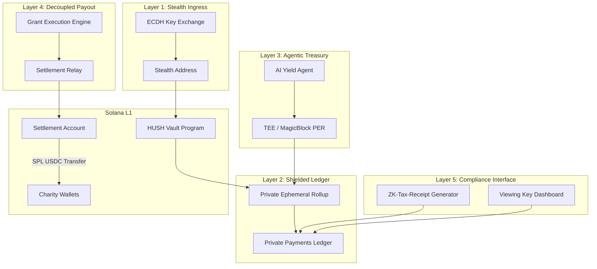
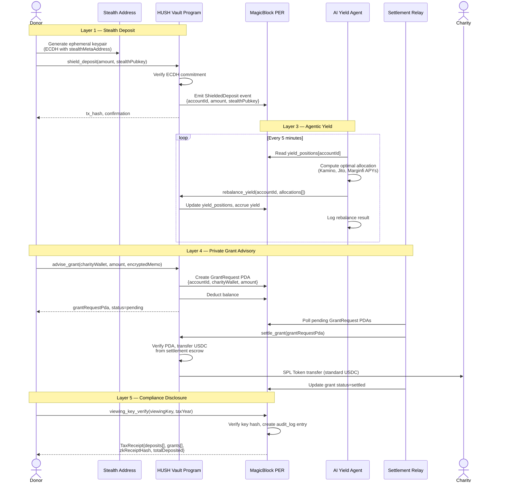
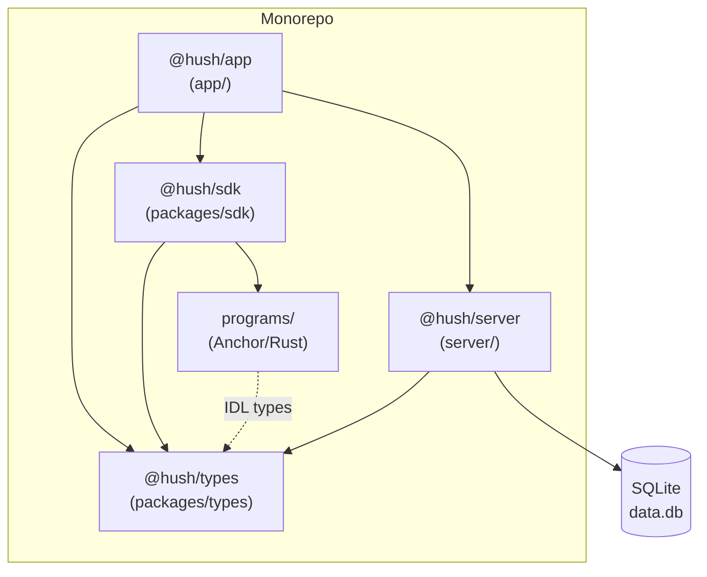

# HUSH — System Architecture

**Version:** 0.1.0  
**Last Updated:** 2025

---

## Overview

HUSH is a 5-layer system designed around one constraint: a high-net-worth donor must be able to make, manage, and disclose charitable contributions without revealing identity, grant amounts, or treasury composition to the public Solana ledger. Each layer handles a distinct privacy concern.

---

## 1. System Overview



### Layer Responsibilities

| Layer | Component | Responsibility |
|-------|-----------|----------------|
| L1 | Stealth Ingress | Unlink deposit origin from donor identity |
| L2 | Shielded Ledger | Store account state off the public ledger |
| L3 | Agentic Treasury | Autonomously maximise yield on idle capital |
| L4 | Decoupled Payout | Settle grants to charities without donor linkage |
| L5 | Compliance Interface | Enable selective, auditable disclosure |

---

## 2. Program Instruction Flow



---

## 3. Monorepo Component Dependencies



### Package Descriptions

| Package | Path | Purpose |
|---------|------|---------|
| `@hush/types` | `packages/types/` | Shared TypeScript interfaces, enums, and Zod schemas |
| `@hush/sdk` | `packages/sdk/` | Client-side library: stealth address generation, viewing key management, API client |
| `@hush/app` | `app/` | Next.js 14 donor dashboard with server components and streaming |
| `@hush/server` | `server/` | Express API: accounts, transactions, compliance, cron agents |
| `programs/hush` | `programs/hush/` | Anchor program: shield_deposit, rebalance_yield, advise_grant, settle_grant |

---

## 4. Data Flow

### 4.1 Deposit Flow

```
[Donor Wallet] → ECDH(ephemeralKey, stealthMetaAddress)
              → [One-time stealth address]
              → shield_deposit(amount) instruction
              → [HUSH Vault Program]
              → ShieldedDeposit event → [MagicBlock PER]
              → Update dafAccounts.balanceUsdc (shielded)
              → Return {txHash, stealthPubkey} to donor
```

On the public Solana ledger, only a USDC transfer to an unrelated address is visible. The amount is not encrypted on L1 (Solana does not natively support confidential amounts), but the recipient address is unlinkable to the DAF account. In the production roadmap, Confidential Transfer extensions on SPL Token 2022 will hide amounts as well.

### 4.2 Yield Flow

```
[YieldAgent cron: */5 * * * *]
  → Read all active accounts from MagicBlock PER
  → For each account:
      → Fetch live APY from Kamino/Jito/Marginfi oracles
      → Compute optimal allocation (maximise weighted APY, cap single-protocol risk at 60%)
      → Submit rebalance_yield instruction to HUSH Vault
      → Vault updates yield_positions in PER
      → Accrue yield since lastRebalancedAt
  → Log cycle summary
```

The YieldAgent runs in a constrained execution environment (MagicBlock PER). It holds no withdrawal authority — it can only submit rebalance instructions that move capital between whitelisted DeFi protocols. All protocol interactions go through the Vault Program's CPI (Cross-Program Invocation) layer.

### 4.3 Grant Advisory Flow

```
[Donor]
  → POST /api/v1/accounts/:id/grant
  → Validate: balance ≥ amount, account active
  → Create GrantRequest PDA in MagicBlock PER
  → Deduct balance (reserve funds)
  → Return {grantId, status: 'pending', grantRequestPda}

[SettlementRelay — polling every 10s]
  → Read pending GrantRequest PDAs from PER
  → For each PDA:
      → Build settle_grant instruction
      → Submit to HUSH Vault Program
      → Vault CPI: transfer USDC from settlement escrow to charityWallet
      → Update grant status → 'settled'
      → Record settlementTxHash
```

The critical privacy property: the charity-visible transaction comes from `HUSH_SETTLEMENT_ACCOUNT`, not from any donor-linked address. A chain analyst watching the charity wallet sees periodic USDC receipts from a shared settlement pool — the same pattern as a traditional payment processor.

### 4.4 Compliance Disclosure Flow

```
[Auditor / Donor]
  → POST /api/v1/accounts/:id/viewing-key
  → { viewingKey, taxYear, scope }

[ViewingKeyService]
  → verifyKey: SHA-256(viewingKey) == account.viewingKeyHash
  → If verified:
      → Query deposits WHERE tax_year = taxYear, status = 'confirmed'
      → Query grants WHERE tax_year = taxYear, status = 'settled'
      → Compute totals
      → Generate zkReceiptHash = SHA-256(accountId:taxYear:totalDeposits:totalGrants:timestamp)
      → INSERT audit_logs record (immutable)
  → Return TaxReceiptData{deposits[], grants[], zkReceiptHash, ...}
```

---

## 5. Security Considerations

### Threat Model

HUSH is designed to protect against:

1. **On-chain observer** — An adversary reading Solana's public ledger should not be able to determine: (a) that a stealth address belongs to any HUSH account, (b) that a settlement payment originated from any specific donor, or (c) the balance of any DAF account.

2. **Metadata correlation** — Deposit amounts and timing vary enough that simple correlation attacks (same amount deposited and granted) are not sufficient for attribution. In production, Confidential Transfer amounts eliminate amount correlation entirely.

3. **Viewing key misuse** — Viewing keys are scoped and every use generates an immutable audit log. A key cannot be used to withdraw funds — it is read-only. Key revocation is on the production roadmap.

### Known Limitations (PoC)

| Limitation | Production Mitigation |
|------------|----------------------|
| Balances stored as plaintext `REAL` in SQLite | Encrypt with account-derived key in MagicBlock PER |
| Stealth pubkeys are randomly generated (not real ECDH) | Integrate Umbra SDK for genuine ECDH stealth addresses |
| `zkReceiptHash` is SHA-256, not a ZK proof | Replace with Groth16 circuit (snarkjs + circom) |
| Settlement relay is simulated | Integrate HUSH Vault Program `settle_grant` instruction |
| Viewing key is hashed with SHA-256 | Use on-chain ZK commitment (Pedersen hash) |
| No key rotation mechanism | Implement viewing key update instruction in Vault Program |

### Authentication

The current API has no authentication layer — accounts are accessed by numeric ID. Production authentication requires:
- Wallet signature verification (`signMessage` with nonce) for all write operations
- JWT or session token derived from wallet signature for stateful sessions
- Rate limiting on viewing key verification to prevent brute force (10 attempts per hour per IP)

---

## 6. Integration Points

### Umbra SDK

The Umbra stealth address protocol (ERC-5564 adapted for Solana) provides:
- `generateStealthAddress(stealthMetaAddress, ephemeralPrivKey)` → `{stealthAddress, ephemeralPubKey}`
- `scanForDeposits(scanKey, deposits[])` → `Deposit[]` (identifies deposits belonging to this scan key)
- `generateStealthMetaAddress(spendKey, viewKey)` → `stealthMetaAddress`

Integration point: `AccountService.createDeposit()` currently simulates this with `crypto.randomBytes`. Replace with Umbra SDK calls for real ECDH stealth address generation.

### MagicBlock SDK

MagicBlock Private Ephemeral Rollup provides:
- Confidential state storage (account balances, grant advisories)
- TEE-attested compute environment for the AI Yield Agent
- Transaction batching with commit-to-L1 on settlement

Integration point: `db/client.ts` currently uses SQLite as a PoC state store. In production, all read/write operations on `dafAccounts`, `yieldPositions`, and `grants` route through the MagicBlock PER SDK.

### Kamino Finance

- **Purpose:** Highest APY lending market on Solana (USDC supply APY: 6–9%)
- **Integration:** Vault Program CPI to `kamino_lending::deposit_reserve_liquidity`
- **Risk cap:** Max 60% of account balance allocated to any single protocol

### Jito (Liquid Staking)

- **Purpose:** SOL staking yield expressed as jitoSOL; USDC allocated via Jito vault
- **Integration:** CPI to Jito vault deposit instruction
- **Risk profile:** Lower counterparty risk than lending protocols; lower APY ceiling (~7–8%)

### Marginfi

- **Purpose:** Cross-collateral lending with risk-engine isolation
- **Integration:** CPI to `marginfi::bank::deposit`
- **Risk cap:** Max 40% allocation due to liquidation risk in volatile markets

### Jito MEV Tips (Settlement Relay)

In production, the Settlement Relay uses Jito bundle submission for grant settlement transactions. This provides:
- Priority inclusion (ahead of standard mempool)
- MEV protection (no sandwich attacks on the USDC transfer)
- Atomic bundle execution (the GrantRequest PDA consumption and USDC transfer are atomic)
